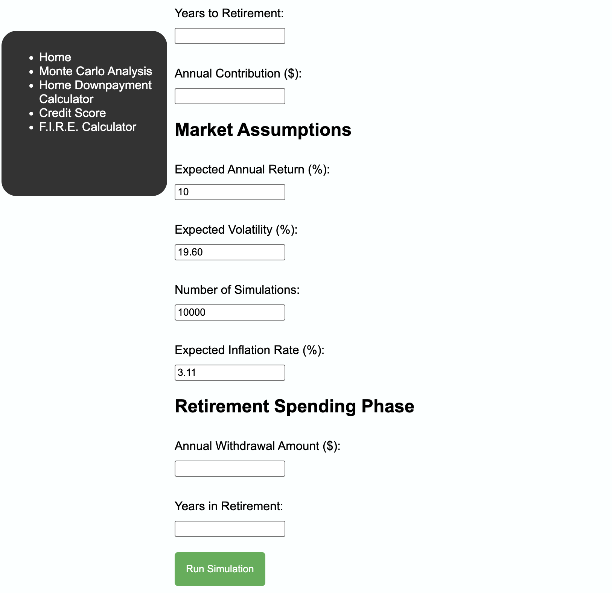

# 💰 Personal Finance Website
***Interactive tools to plan, simulate, and optimize your financial future.***

## 📌 Overview

The Personal Finance Website is an interactive, web-based platform designed to help users make informed financial decisions through a suite of practical tools. It provides a comprehensive approach to personal finance by combining calculators, simulations, and analysis features that cover investments, credit, and long-term financial planning.

Users can plan for financial independence using the **FIRE Calculator**, analyze potential rental property investments, simulate portfolio outcomes with **Monte Carlo Analysis**, and monitor their credit health. The platform transforms complex financial concepts into clear, actionable insights, allowing users to experiment with different scenarios and understand the potential impact of their decisions.

This project also demonstrates core front-end development skills. It incorporates **advanced JavaScript logic** to perform calculations, **dynamic DOM manipulation** to display real-time results, and **input validation** to ensure accuracy. Additionally, the site features a **responsive and user-friendly interface**, emphasizing usability while highlighting technical proficiency.

By building this project, I showcased the ability to bridge the gap between real-world financial problem-solving and interactive web development, creating a tool that is both educational and practical for users.

---

## 🚀 Features

- **FIRE Calculator:** Estimate your financial independence timeline based on current savings, contributions, and expected returns.  
- **Rental Property Analyzer:** Calculate down payments, projected cash flow, and long-term investment potential for rental properties.  
- **Monte Carlo Simulation:** Simulate thousands of investment outcomes to understand portfolio risk and variability over time.  
- **Credit Score Estimator:** Assess the impact of different factors, such as payment history and credit utilization, on your credit score.  

---

## 📂 Technologies Used

- **HTML5**  
- **CSS3**  
- **JavaScript (ES6+)**  
- **DOM Manipulation**  

---

## 📦 How to Use

Click below to start using the tools:  

- **Live Demo:** [Try it here](https://sarahborgelt.github.io/myPersonalFinance/index.html)  
- **Source Code:** [GitHub Repository](https://github.com/sarahborgelt/myPersonalFinance)

---

## 🧠 Lessons Learned

- Implementing complex financial calculations using JavaScript  
- Handling dynamic, interactive user input and validation  
- Designing a clean and responsive UI for practical tools  
- Using simulations and conditional logic to demonstrate probabilistic outcomes
